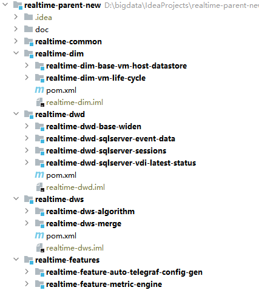
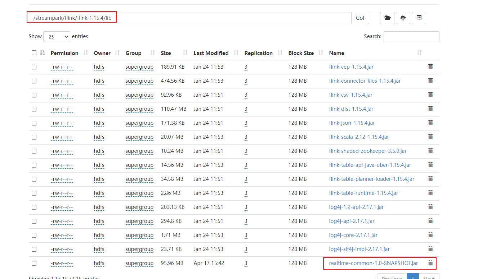
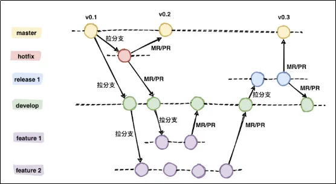
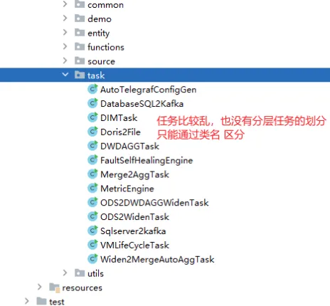

# release-2.0.x 版本特性

## 版本特性
- 1、重构代码结构
  - 父工程下创建五个module，如下
    - （1）realtime-common：用于引入公共的第三方依赖，编写工具类、实体类等。
    - （2）realtime-dim：用于编写DIM层业务代码。
    - （3）realtime-dwd：用于编写DWD层业务代码。
    - （4）realtime-dws：用于编写DWS层业务代码。
    - （5）realtime-feature：用于编写大数据功能应用业务代码。
  - 其中，后四个module统称为业务模块，业务模块都要将realtime-common模块作为依赖引入。
  - 
- 2、轻量Jar包方案
  - 所有业务的一些第三方公共依赖提前打包好，提前放到hadoop flink lib 目录下。每个Job打包时就可以不打这些公共依赖了，只把业务代码和相应单独的依赖打进去。这样Jar包就会很小，打包非常快、调试方便。
  -  我们在Flink 项目里创建一个 common 模块，把所有公共的依赖和可复用的代码放到这个模块，单独打包放到Flink的lib目录下
  - 
- 3、采用GitFlow工作流模式进行代码管理
- 

## 解决了那些问题
- 1、任何Job代码变更，都要重新打包、发布上线【特别麻烦，因为数仓的任务会越来越多】
- 2、Jar包特别大，编译打包慢、上传慢、发布现场测试麻烦【邮件不能发送过大的内容】
- 3、Jar包版本管理混乱，牵一发而动全身【可能新引入的功能会造成之前的代码报错】
- 4、代码分层结构差，只能通过类名区分，是ods，dws、dws、ads、dim的任务
- 5、git没有版本控制，每次发布现场不知道是什么版本
- 